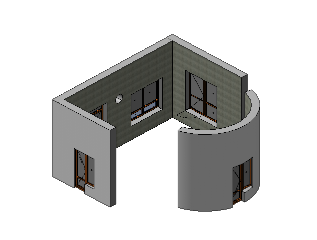
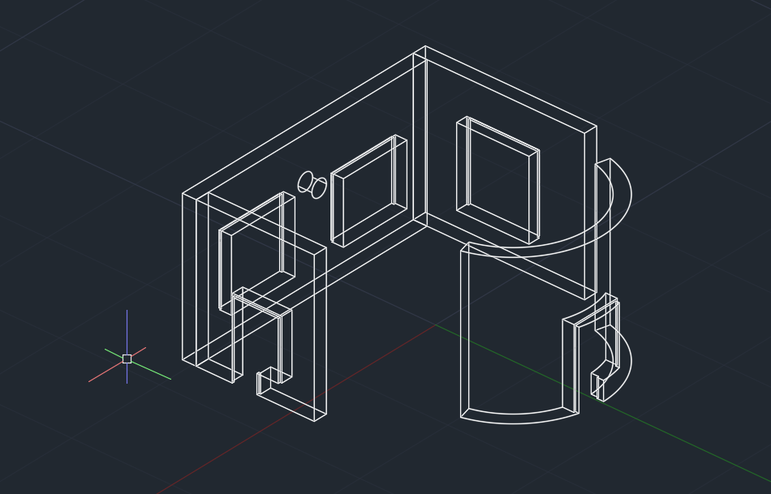

# RevitExportGeometryToAutocad
Вспомогательные библиотеки для отрисовки геометрии из Revit в AutoCAD в виде простых объектов (отрезок, дуга, точка) посредством экспорта в xml
## Описание
Библиотеки пригодятся при разработке плагинов, связанных с геометрией, для удобного визуального восприятия результатов. На мой взгляд просматривать результат в AutoCAD намного удобнее.

В данном проекте присутствует две библиотеки (одна для Revit, вторая для AutoCAD) и демо-проект для Revit.
## Версионность
Проект для AutoCAD собран с использованием библиотек от AutoCAD 2013. Будет работать со всеми последующими версиями AutoCAD

Проект Revit собран с использованием библиотек от Revit 2015. Должен работать со всеми последующими версиями (с 2015-2018 точно работает)
## Использование
Решение также содержит демо-проект для Revit. Описание использования на примере этого проекта:

**В Revit**
* Подключить к проекту ссылку на библиотеку **RevitGeometryExporter.dll**.
* Перед использованием методов экспорта нужно указать папку для экспорта xml
```csharp
// setup export folder
ExportGeometryToXml.FolderName = @"C:\Temp";
```
По умолчанию в библиотеке прописан путь *C:\Temp\RevitExportXml*. В случае отсутствия директории она будет создана.
*	Вызвать один или несколько методов экспорта геометрии. 
Например:
```csharp
List<Wall> wallsToExport = new List<Wall>();
foreach (Reference reference in selectionResult)
{
    Wall wall = (Wall)doc.GetElement(reference);
    wallsToExport.Add(wall);
}
ExportGeometryToXml.ExportWallsByFaces(wallsToExport, "walls");
```
Или
```csharp
List<FamilyInstance> familyInstances = new List<FamilyInstance>();
foreach (Reference reference in selectionResult)
{
    Element el = doc.GetElement(reference);
    if(el is FamilyInstance familyInstance)
        familyInstances.Add(familyInstance);
}
ExportGeometryToXml.ExportFamilyInstancesByFaces(familyInstances, "families", false);
```

**В AutoCAD**
*	С помощью команды **NETLOAD** загрузить библиотеку **CadDrawGeometry.dll**.
* Использовать одну из двух доступных команд:

**DrawFromOneXml** – отрисовка геометрии из одного указанного xml-файла

**DrawXmlFromFolder** - отрисовка геометрии из указанной папки в который должны располагаться xml-файлы

## Пример
Элементы в Revit:



Результат экспорта и отрисовки геометрии в AutoCAD:


