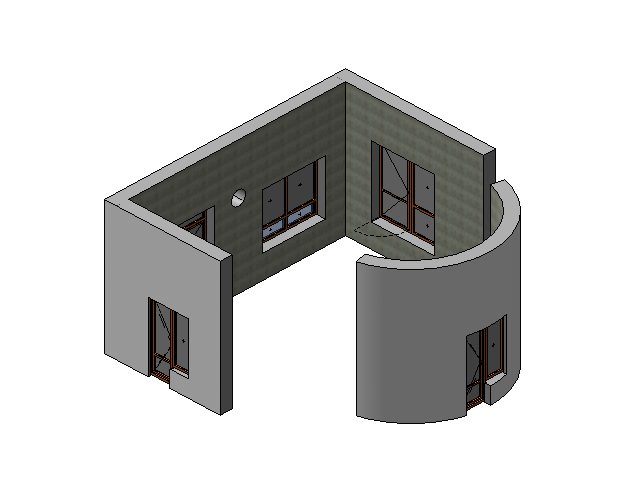
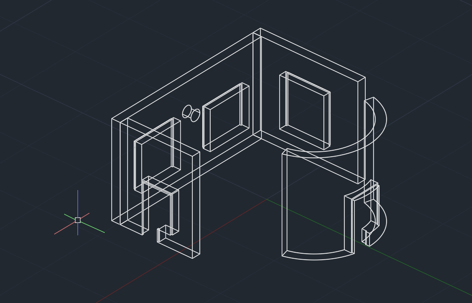

# RevitExportGeometryToAutocad

**[Русский](#ru) | [English](#en)**

<a name="ru"></a>
## Русский

Вспомогательные библиотеки для отрисовки геометрии из Revit в AutoCAD в виде простых объектов (отрезок, дуга, точка) посредством экспорта в xml

### Описание
Библиотеки пригодятся при разработке плагинов, связанных с геометрией, для удобного визуального восприятия результатов. На мой взгляд просматривать результат в AutoCAD намного удобнее.

В данном проекте присутствует две библиотеки (одна для Revit, вторая для AutoCAD) и демо-проект для Revit.

### Версионность
Проект для AutoCAD собран с использованием библиотек от AutoCAD 2013. Будет работать со всеми последующими версиями AutoCAD

Проект Revit собран с использованием библиотек от Revit 2015. Должен работать со всеми последующими версиями (с 2015-2018 точно работает)

Библиотека **RevitGeometryExporter** собирается под `net45` и `net48` и распространяется как NuGet-пакет.

### Использование
Решение также содержит демо-проект для Revit. Описание использования на примере этого проекта:

#### В Revit

RevitGeometryExporter нужна только на этапе разработки и отладки. Библиотека устроена так, что в Debug она работает и копируется в выходную папку, а в Release вызовы её методов удаляются компилятором и сама dll в выходную папку не попадает. Никаких `#if DEBUG` и путей к dll в проекте не требуется.

##### Как это работает
* Все публичные методы `ExportGeometryToXml` помечены атрибутом `[Conditional("DEBUG")]` – как `Debug.Print`. Если в проекте, который **вызывает** метод, не определена константа `DEBUG`, компилятор удаляет вызов целиком (включая вычисление аргументов). В итоговой сборке плагина не остаётся даже ссылки на RevitGeometryExporter.
* В пакет вложен файл `RevitGeometryExporter.targets`, который NuGet автоматически подключает к проекту. Если в `DefineConstants` проекта есть `DEBUG`, он добавляет `RevitGeometryExporter.dll` в список копируемых в выходную папку файлов (независимо от настроек копирования NuGet-зависимостей в проекте), если нет – удаляет её оттуда.
* Решение принимается по константе `DEBUG`, а не по имени конфигурации, поэтому работает и с пользовательскими конфигурациями (например, под версии Revit) – важно лишь, определён ли в них `DEBUG`.
* Константа должна называться именно `DEBUG` – символы условной компиляции в C# чувствительны к регистру, `Debug` не подойдёт. SDK-проекты автоматически добавляют константу из имени конфигурации в верхнем регистре, поэтому в конфигурации `Debug` константа `DEBUG` есть всегда, а в конфигурации, например, `Debug2025` появится только `DEBUG2025` – там `DEBUG` нужно добавить явно. Если в пользовательской конфигурации `DefineConstants` задаётся вручную, не затирайте стандартные константы:
```xml
<DefineConstants>$(DefineConstants);DEBUG;R2025</DefineConstants>
```

Условия на `PackageReference` по `$(Configuration)` для этой задачи не подходят: restore NuGet выполняется один раз для всех конфигураций, а копирование в выходную папку решается уже на этапе сборки – там и сделано исключение.

##### Подключение
Пакет подключается во всех конфигурациях (чтобы код компилировался):
```xml
<ItemGroup>
  <PackageReference Include="RevitGeometryExporter" Version="1.3.1" PrivateAssets="all" />
</ItemGroup>
```
`PrivateAssets="all"` – чтобы пакет не превращался в транзитивную зависимость проектов, которые ссылаются на ваш.

**Проекты под .NET Framework (net45 – net48)** – ничего дополнительно не требуется.

**Проекты под net8.0 / net10.0 (Revit 2025+)**:
* Дополнительные свойства (`CopyLocalLockFileAssemblies`, `EnableDynamicLoading`) **не нужны**. В SDK-проектах библиотек под современный .NET dll из NuGet-пакетов по умолчанию не копируются в выходную папку, но targets-файл пакета сам добавляет `RevitGeometryExporter.dll` в список копируемых файлов, если определена константа `DEBUG`. Включать `CopyLocalLockFileAssemblies` ради этого пакета не стоит – тогда в выходную папку попадут все зависимости всех пакетов (например, `runtimes` и сборки WebView2).
* Пакет содержит сборки только под .NET Framework, поэтому при restore появится предупреждение **NU1701** (используется сборка `net48`). Это ожидаемо, его можно отключить:
```xml
<PackageReference Include="RevitGeometryExporter" Version="1.3.1" PrivateAssets="all" NoWarn="NU1701" />
```
* Именно поэтому в пакете есть сборка `net48`: для net8.0/net10.0 NuGet умеет подставлять только сборки net461 – net481, а `net45` в этот список не входит. По той же причине targets-файл лежит в `build\net45` и `build\net48`, а не в корне `build`: если бы в пакете был TFM-независимый `build\*.targets`, NuGet считал бы пакет совместимым с net8.0, не применял бы подстановку net48 и молча не подключал бы саму dll.

##### Использование в коде
* Инициализация – папка для экспорта xml и (при необходимости) единицы вывода:
```csharp
// setup export folder
ExportGeometryToXml.Init(@"C:\Temp");

// setup export folder and units (feet or millimeters)
ExportGeometryToXml.Init(@"C:\Temp", ExportUnits.Mm);

// setup export folder, units and clear folder
ExportGeometryToXml.Init(@"C:\Temp", ExportUnits.Mm, true);
```
По умолчанию в библиотеке прописан путь *C:\Temp\RevitExportXml*, единицы – футы. В случае отсутствия директории она будет создана.

> **Важно!** Свойства `ExportGeometryToXml.FolderName` и `ExportGeometryToXml.ExportUnits` доступны только для чтения – задаются они только через методы `Init(...)`. Читать их в коде плагина также не следует: атрибут `[Conditional]` действует только на методы, поэтому обращение к свойству останется в Release-сборке, а dll в выходной папке не будет – плагин упадёт во время работы.

* Вызвать один или несколько методов экспорта геометрии. Например:
```csharp
List<Wall> wallsToExport = new List<Wall>();
foreach (Reference reference in selectionResult)
{
    Wall wall = (Wall)doc.GetElement(reference);
    wallsToExport.Add(wall);
}
ExportGeometryToXml.ExportWallsByFaces(wallsToExport, "walls");
```
Или
```csharp
List<FamilyInstance> familyInstances = new List<FamilyInstance>();
foreach (Reference reference in selectionResult)
{
    Element el = doc.GetElement(reference);
    if(el is FamilyInstance familyInstance)
        familyInstances.Add(familyInstance);
}
ExportGeometryToXml.ExportFamilyInstancesByFaces(familyInstances, "families", false);
```
Директивы `#if DEBUG` вокруг этих вызовов не нужны.

##### Сборка пакета
* Пакет создаётся автоматически при сборке проекта RevitGeometryExporter в конфигурации **Release** (`GeneratePackageOnBuild`) и кладётся в `RevitGeometryExporter\bin\nupkg`.
* Версия пакета задаётся свойством `<Version>` в `RevitGeometryExporter.csproj`, версия сборки – в `Properties\AssemblyInfo.cs`.
* Сборка самой библиотеки в Release не влияет на поведение: удаление вызовов зависит от константы `DEBUG` проекта, который использует библиотеку.

#### В AutoCAD
* С помощью команды **NETLOAD** загрузить библиотеку **CadDrawGeometry.dll**.
* Использовать одну из доступных команд:

**DrawFromOneXml** – отрисовка геометрии из одного указанного xml-файла

**DrawFromSeveralXml** – отрисовка геометрии из нескольких указанных xml-файлов. По аналогии с DrawFromOneXml, только в окне выбора файлов включена возможность мультивыбора (через Shift или Ctrl)

**DrawXmlFromFolder** – отрисовка геометрии из указанной папки, в которой должны располагаться xml-файлы

### Пример
Элементы в Revit:



Результат экспорта и отрисовки геометрии в AutoCAD:



---

<a name="en"></a>
## English

Helper libraries for drawing Revit geometry in AutoCAD as simple objects (line, arc, point) via export to xml

### Description
The libraries are useful when developing geometry-related plugins, for convenient visual inspection of the results. In my opinion, viewing the result in AutoCAD is much more convenient.

The solution contains two libraries (one for Revit, one for AutoCAD) and a demo project for Revit.

### Versions
The AutoCAD project is built against AutoCAD 2013 libraries. It will work with all later versions of AutoCAD.

The Revit project is built against Revit 2015 libraries. It should work with all later versions (confirmed for 2015-2018).

The **RevitGeometryExporter** library targets `net45` and `net48` and is distributed as a NuGet package.

### Usage
The solution also contains a demo project for Revit. Usage is described using this project as an example:

#### In Revit

RevitGeometryExporter is needed only during development and debugging. The library is designed so that in Debug it works and is copied to the output folder, while in Release the calls to its methods are removed by the compiler and the dll itself is not copied to the output folder. No `#if DEBUG` directives or paths to the dll are required in the project.

##### How it works
* All public methods of `ExportGeometryToXml` are marked with the `[Conditional("DEBUG")]` attribute – just like `Debug.Print`. If the `DEBUG` constant is not defined in the project that **calls** the method, the compiler removes the call entirely (including argument evaluation). The resulting plugin assembly does not even keep a reference to RevitGeometryExporter.
* The package contains the `RevitGeometryExporter.targets` file, which NuGet automatically imports into the project. If the project's `DefineConstants` contains `DEBUG`, it adds `RevitGeometryExporter.dll` to the list of files copied to the output folder (regardless of the project's NuGet dependency copy settings); otherwise it removes the dll from that list.
* The decision is based on the `DEBUG` constant, not on the configuration name, so it also works with custom configurations (for example, per Revit version) – all that matters is whether `DEBUG` is defined in them.
* The constant must be named exactly `DEBUG` – conditional compilation symbols in C# are case-sensitive, `Debug` will not work. SDK-style projects automatically add a constant made from the configuration name in upper case, so the `Debug` configuration always has `DEBUG`, while a configuration such as `Debug2025` only gets `DEBUG2025` – there `DEBUG` must be added explicitly. If you set `DefineConstants` manually in a custom configuration, do not overwrite the standard constants:
```xml
<DefineConstants>$(DefineConstants);DEBUG;R2025</DefineConstants>
```

Conditions on `PackageReference` based on `$(Configuration)` are not suitable for this task: NuGet restore runs once for all configurations, while copying to the output folder is decided at build time – that is where the exclusion is done.

##### Installation
The package is referenced in all configurations (so the code compiles):
```xml
<ItemGroup>
  <PackageReference Include="RevitGeometryExporter" Version="1.3.1" PrivateAssets="all" />
</ItemGroup>
```
`PrivateAssets="all"` prevents the package from becoming a transitive dependency of projects that reference yours.

**.NET Framework projects (net45 – net48)** – nothing else is required.

**net8.0 / net10.0 projects (Revit 2025+)**:
* Additional properties (`CopyLocalLockFileAssemblies`, `EnableDynamicLoading`) are **not needed**. In SDK-style class libraries for modern .NET, dlls from NuGet packages are not copied to the output folder by default, but the package's targets file adds `RevitGeometryExporter.dll` to the list of copied files itself when the `DEBUG` constant is defined. Do not enable `CopyLocalLockFileAssemblies` for this package – it would copy all dependencies of all packages to the output folder (for example, `runtimes` and WebView2 assemblies).
* The package contains only .NET Framework assemblies, so restore produces warning **NU1701** (the `net48` assembly is used). This is expected and can be suppressed:
```xml
<PackageReference Include="RevitGeometryExporter" Version="1.3.1" PrivateAssets="all" NoWarn="NU1701" />
```
* That is why the package contains a `net48` assembly: for net8.0/net10.0 NuGet can fall back only to net461 – net481 assemblies, and `net45` is not in that list. For the same reason the targets file is placed in `build\net45` and `build\net48` rather than in the root of `build`: with a TFM-independent `build\*.targets`, NuGet would consider the package compatible with net8.0, would not apply the net48 fallback and would silently not reference the dll itself.

##### Usage in code
* Initialization – the folder for xml export and (optionally) output units:
```csharp
// setup export folder
ExportGeometryToXml.Init(@"C:\Temp");

// setup export folder and units (feet or millimeters)
ExportGeometryToXml.Init(@"C:\Temp", ExportUnits.Mm);

// setup export folder, units and clear folder
ExportGeometryToXml.Init(@"C:\Temp", ExportUnits.Mm, true);
```
The default path is *C:\Temp\RevitExportXml*, the default units are feet. If the directory does not exist, it will be created.

> **Important!** The `ExportGeometryToXml.FolderName` and `ExportGeometryToXml.ExportUnits` properties are read-only – they are set only via the `Init(...)` methods. Do not read them in plugin code either: the `[Conditional]` attribute applies only to methods, so a property access stays in the Release build while the dll is not in the output folder – the plugin will crash at runtime.

* Call one or more geometry export methods. For example:
```csharp
List<Wall> wallsToExport = new List<Wall>();
foreach (Reference reference in selectionResult)
{
    Wall wall = (Wall)doc.GetElement(reference);
    wallsToExport.Add(wall);
}
ExportGeometryToXml.ExportWallsByFaces(wallsToExport, "walls");
```
Or
```csharp
List<FamilyInstance> familyInstances = new List<FamilyInstance>();
foreach (Reference reference in selectionResult)
{
    Element el = doc.GetElement(reference);
    if(el is FamilyInstance familyInstance)
        familyInstances.Add(familyInstance);
}
ExportGeometryToXml.ExportFamilyInstancesByFaces(familyInstances, "families", false);
```
No `#if DEBUG` directives are needed around these calls.

##### Building the package
* The package is created automatically when the RevitGeometryExporter project is built in the **Release** configuration (`GeneratePackageOnBuild`) and is placed in `RevitGeometryExporter\bin\nupkg`.
* The package version is set by the `<Version>` property in `RevitGeometryExporter.csproj`, the assembly version – in `Properties\AssemblyInfo.cs`.
* Building the library itself in Release does not affect the behavior: call removal depends on the `DEBUG` constant of the project that uses the library.

#### In AutoCAD
* Load **CadDrawGeometry.dll** using the **NETLOAD** command.
* Use one of the available commands:

**DrawFromOneXml** – draw geometry from one selected xml file

**DrawFromSeveralXml** – draw geometry from several selected xml files. Same as DrawFromOneXml, but multiple selection (with Shift or Ctrl) is enabled in the file dialog

**DrawXmlFromFolder** – draw geometry from all xml files in the selected folder

### Example
Elements in Revit:


Result of export and drawing in AutoCAD:


